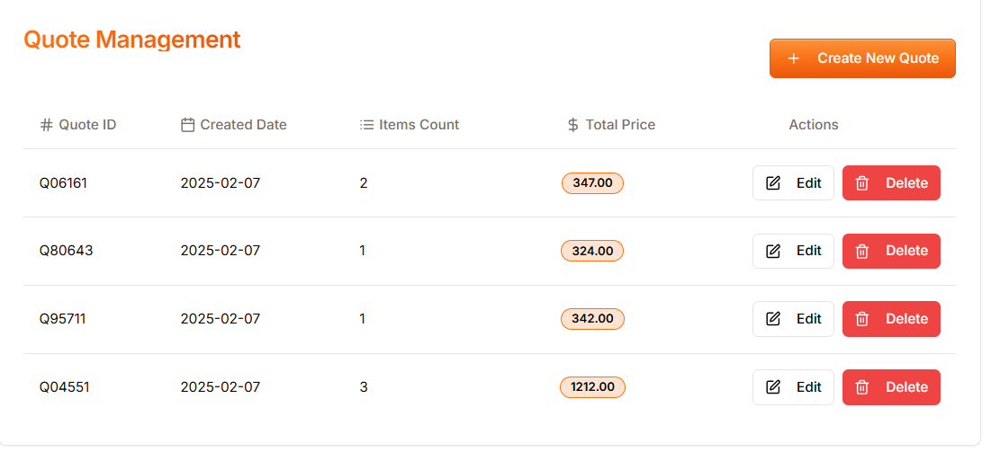
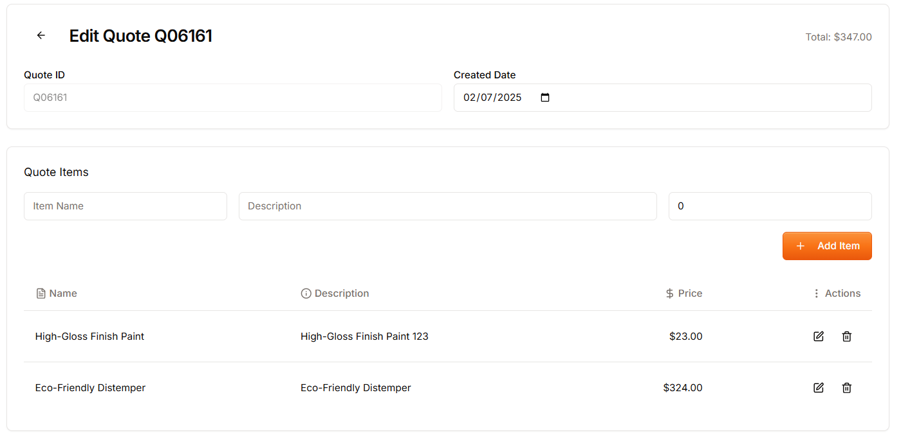

# Live Demo

[Quotation Management Tool](https://quotation-management-tool.vercel.app/)

## Dashboard UI



## Edit Page UI



# Quotation Management Tool Features

### **1. Create Multiple Quotations**

Admins can easily generate multiple quotations by adding item details such as name, description, and price.

### **2. Edit Quotations**

Modify existing quotations seamlessly, allowing updates to item details or pricing.

### **3. Delete Quotations**

Remove unnecessary quotations with a simple action for better data management.

### **4. View Quotations**

Admins can view detailed quotation information, including itemized breakdowns and total pricing.

### **5. Persistent Data**

All data is stored locally in JSON, ensuring it remains intact even after page refreshes.

### **6. User-Friendly UI**

Clean and modern design with intuitive interfaces for a better user experience.

### **7. Robust Validation**

Proper input validation ensures data accuracy and consistency.

### **8. Responsive Design**

Fully optimized for desktops, tablets, and mobile devices to deliver a seamless experience across screen sizes.

### **9. Undo/Redo Functionality**

Maintain data integrity with the ability to undo or redo actions when managing quotations.

### **10. Deployed on Vercel**

The application is deployed on Vercel for fast, reliable, and scalable performance.

### **11. Tech Stack**

Built with Next.js, Tailwind CSS, and Shadcn UI components for a powerful and scalable solution.

# Technologies Used

- [Next.js](https://nextjs.org/): The React Framework for Production.
  🚀

- [Shadcn Ui](https://ui.shadcn.com/): Beautifully designed components that you can copy and paste into your apps. Accessible. Customizable. Open Source.🤖

- [Tailwind CSS](https://tailwindcss.com/): A utility-first CSS framework for rapidly building custom designs.🐊

# Getting Started

These instructions will help you set up and run the project on your local machine.

### Prerequisites

- Node.js: [Download and install Node.js](https://nodejs.org/)

### Installation

1. Clone the repository:

   ```bash
   git clone
   ```

2. install node modules:

   ```bash
   npm install
   ```

3. Run:

   ```bash
    npm run dev
   ```
